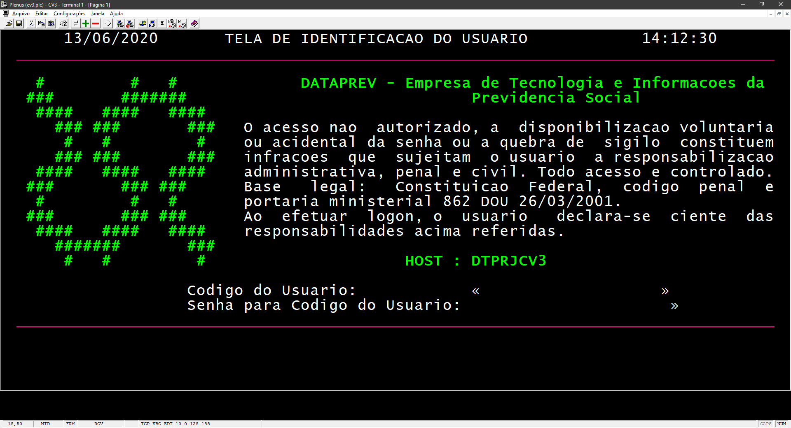

# plenuscv3

## Este repositório
Este repositório contém os arquivos utilizados no desenvolvimento do Instalador do Plenus CV3 que é utilizado no Instituto Nacional do Seguro Social durante o reconhecimento de direitos previdenciários.

* [Notas de lançamento](docs/atualizacoes.md)

## Plenus CV3

  

O Plenus é um aplicativo criado pela empresa Octus Informática para emulação de terminais que acessam mainframes Unisys. No INSS, o mainframe acessado é chamado de CV3.

O aplicativo original não dispõe de instalador nem configurador, razão que obriga os servidores a necessitarem de auxílio técnico remoto da Dataprev para configuração do seus computadores de trabalho. Isso causa perda de tempo e foi motivo de atrasos durante a migração dos servidores para o regime de trabalho remoto durante a pandemia de COVID-19.

## Recursos
Além do instalador autônomo, este projeto inclui as seguintes alterações no Plenus:

* Uso das teclas CTRL+C e CTRL+V para cópia e cola de texto.
* Uso das teclas CTRL+P para impressão de tela.
* Geração automática do código de acesso ao servidor CV3.
* Uso de teclas de função para comandos rápidos.
* Configuração automática do módulo RPRINT.
* Balanceamento de carga automática para os IPs de acesso do CV3.

## Comandos Rápidos
O Plenus foi configurado com os seguintes comandos rápidos:

| Teclas de Atalho | Comando |
|-----------------|---------|
|F1|BEN SIS|
|F2|PESPCF|
|F3|PESNOM|
|F4|PESNIT|
|F5|PESINS|
|F6|INFBEN|
|F7|TITULA|
|F8|INSTIT|
|F9|DEPEND|
|F10|REPRES|
|F11|HISCRE|
|F12|HISCAL|
||
|CTRL+F1|CONSIT|
|CTRL+F2|CONHAB|
|CTRL+F3|CONBAS|
|CTRL+F4|CONIND|
|CTRL+F10|CONCRI|
|CTRL+F11|CONREV|
|CTRL+F12|CONRMI|
||
|ALT+F1|CTCNOM|
|ALT+F2|CTCSIT|
|ALT+F3|PESCRE|
|ALT+F5|AUTCRE|
|ALT+F9|BLOCRE|
|ALT+F10|CESOBI|
|ALT+F11|REATNB|
||
|SHIFT+F1|HISMED|
|SHIFT+F2|HISOCR|
|SHIFT+F3|HISCP|
|SHIFT+F4|HISCNS|
|SHIFT+F11|HISOCR|
|SHIFT+F12|LIBDUP|

## Ferramentas
Para compilar e gerar o Instalador do Plenus, é necessário:

* Os executáveis originais do Plenus 3.05
* Lazarus 2.0.8.
* Resource Hacker 5.1.7.
* Inno Setup 6.0.5.

Antes de compilar, altere as variáveis FP, ISCC e RH do arquivo build.cmd com os locais de instalação dos compiladores FreePascal, InnoSetup e da ferramenta Resource Hacker.

## Instalador
O Instalador do Plenus está disponível para download na Intranet do INSS. Sua distribuição pela Internet é proibida.

## Licença
O Plenus possui direitos autorais reservados a Octus Informática. Seu uso é permitido apenas no ambiente do INSS.

Os arquivos deste projeto possuem licença MIT. Sinta-se livre para efetuar um fork do projeto e realizar alterações que você desejar.